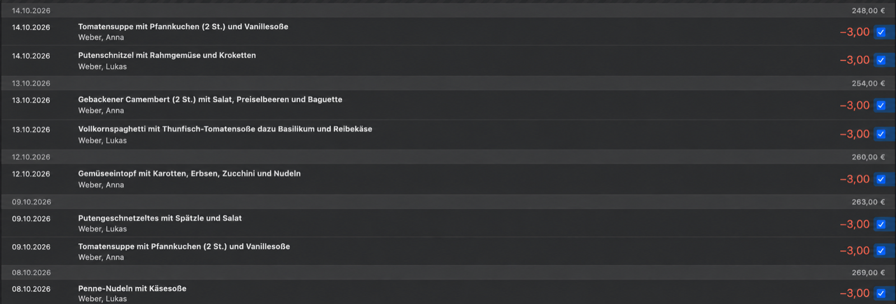

# GEG Gastro für MoneyMoney

Eine [MoneyMoney](https://moneymoney.app)-Erweiterung, die das Guthaben und die
Essensbestellungen aus dem Bestellportal von GEG Gastro
(<https://www.bestellung-geggastro.de>) abruft.

Das Portal bietet keine Schnittstelle. Die Erweiterung meldet sich mit den
Zugangsdaten des Kundenkontos an und liest die Seite »Bestellübersicht« aus.

> [!NOTE]
> Dies ist ein inoffizielles Projekt. Es steht in keiner Verbindung zur
> GEG Gastro Service GmbH oder zu schulmenueplaner.de und wird von diesen
> weder unterstützt noch geprüft. Der Name »GEG Gastro« dient nur dazu, das
> Portal zu bezeichnen, aus dem die Erweiterung Daten abruft.

## Was die Erweiterung liefert

- **Ein Konto** pro Portal-Login mit dem aktuellen Guthaben als Saldo.
- **Ein Umsatz pro Bestellung.** Das Essen steht im Feld »Name«, das Menü
  (z. B. »Zertifiziert« oder »Veggie«) im Buchungstext und der Name des Kindes
  im Verwendungszweck. Mehrere Kinder werden automatisch erkannt.
- **Zukünftige Bestellungen als vorgemerkte Umsätze.** Bestellungen ab morgen
  erscheinen als vorgemerkt, Bestellungen bis einschließlich heute als gebucht.
- **Preis pro Bestellung.** Das Portal zeigt keine Preise. Jede Bestellung
  wird mit einem festen Preis gebucht (Standard 3,00 €), der sich in MoneyMoney
  ändern lässt, siehe [Preis pro Bestellung ändern](#preis-pro-bestellung-ändern).

Beim ersten Abruf werden Bestellungen der letzten 10 Jahre geladen, danach
jeweils ab dem letzten Abruf bis 10 Wochen in die Zukunft.

## Installation

1. `GEG-Gastro.lua` in den Erweiterungsordner von MoneyMoney kopieren:
   `~/Library/Containers/com.moneymoney-app.retail/Data/Library/Application Support/MoneyMoney/Extensions`
   (in MoneyMoney über »Hilfe« → »Zeige Datenbank im Finder« erreichbar).
2. Solange die Erweiterung nicht von MoneyMoney signiert ist, unter
   »MoneyMoney« → »Einstellungen« → »Erweiterungen« die Option
   »Digitale Signatur von Extensions überprüfen« deaktivieren.
3. In MoneyMoney »Konto« → »Konto hinzufügen« → »Andere« → »GEG Gastro«
   wählen und die Zugangsdaten des Portals eingeben.

## Preis pro Bestellung ändern

Ohne weitere Einstellung rechnet die Erweiterung mit 3,00 € pro Bestellung.
Ein anderer Preis wird über ein Konto-Attribut namens `pricePerOrder`
festgelegt. MoneyMoney legt dieses Attribut nicht von selbst an; es muss
einmalig von Hand eingetragen werden:

1. In MoneyMoney das Konto »GEG Gastro Essensbestellung« in der Seitenleiste
   auswählen.
2. »Konto« → »Einstellungen…« öffnen (oder Rechtsklick auf das Konto →
   »Einstellungen…«).
3. Den Reiter »Notizen« wählen. Dort befindet sich die Tabelle mit den
   Attributen des Kontos.
4. Eine neue Zeile hinzufügen: als Name `pricePerOrder`, als Wert den Preis,
   z. B. `3.50` (Punkt oder Komma sind beide erlaubt). Existiert die Zeile
   schon, nur den Wert ändern.
5. Die Einstellungen schließen und einen Kontenrundruf starten.

Der neue Preis gilt für alle Umsätze, die ab diesem Abruf geliefert werden:
vorgemerkte Bestellungen und Bestellungen seit dem letzten Abruf. Bereits
importierte Umsätze behalten ihren alten Betrag. Fehlt das Attribut oder ist
der Wert leer oder keine Zahl, wird mit 3,00 € gerechnet.

Jeder Abruf holt die Bestellungen ab einer Woche vor dem letzten erfolgreichen
Abruf. MoneyMoney erkennt einen Umsatz nur dann als bereits vorhanden, wenn
auch der Betrag übereinstimmt. Nach einer Preisänderung erscheinen die
Bestellungen aus dieser Überlappung daher doppelt, einmal mit dem alten und
einmal mit dem neuen Betrag. Das ist gewollt: So lässt sich für jede
Bestellung der Umsatz mit dem falschen Preis von Hand löschen.

## Nicht enthalten

- Guthaben-Aufladungen als Habenbuchungen.
- Preis-Historie bei Preisänderungen.

## Lizenz

MIT, siehe [LICENSE](LICENSE).
